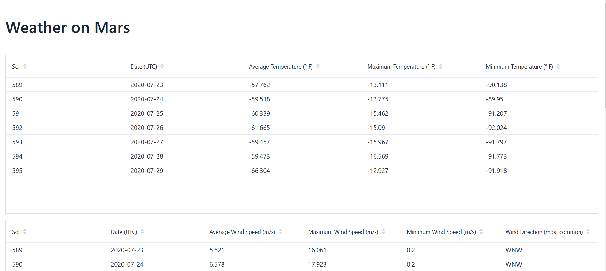
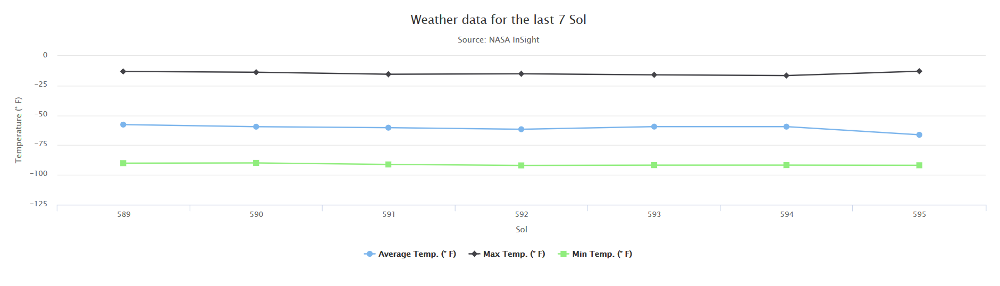
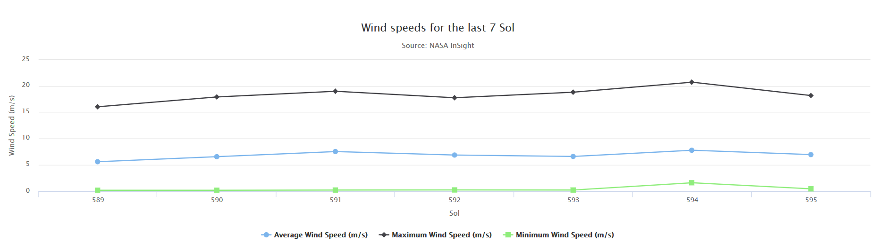

# Summary
This is a simple web application that displays the weather at Elysium Planitia on Mars.  
The Data is obtained through the NASA InSight Weather API. You can get a free API-Key at https://api.nasa.gov/  
Once you have your key, replace the placeholder in the ApiConstants class with it  

```java
public class ApiConstants {
    private static final String API_KEY = "<YOUR API KEY HERE>";
    ......
```

Live demo: No new data for now so I took the link down  
Deployed using heroku (https://heroku.com/)

27.08.2020 - No new data available since Aug. 16, 2020 due to an electronic issue with the mars lander, More info: https://mars.nasa.gov/news/8744/nasa-engineers-checking-insights-weather-sensors/?site=insight

# How to
1. clone the repo and import it to your IDE as an existing Maven project
2. run the app using the Application class
3. navigate to ```localhost:8080/```

# Screenshots
## Title page
 


## Plot
 




## Acknowledgements
Huge thanks to the creators and contributors of the following third party libraries and frameworks which were used in this project  
+ [Vaadin Framework](https://vaadin.com/)  
+ [Google gson](https://github.com/google/gson)  
+ [Caffeine](https://github.com/ben-manes/caffeine)


